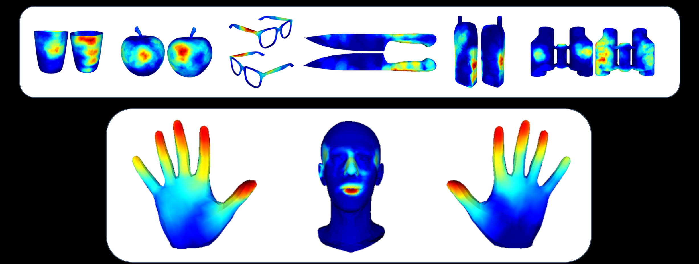
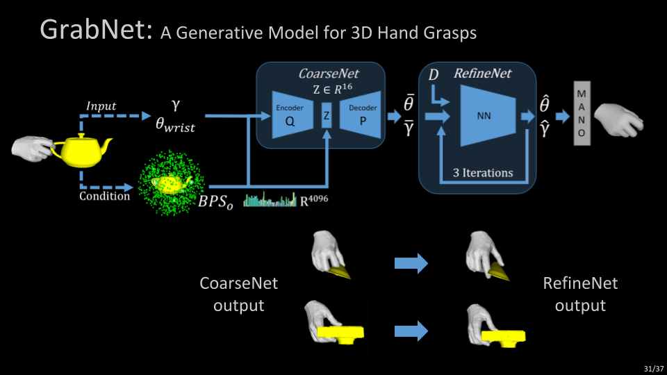
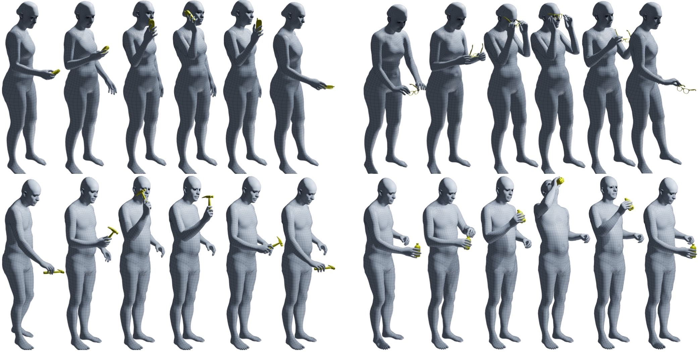

## GRAB: A Dataset of Whole-Body Human Grasping of Objects (ECCV 2020)

## Coming Soon ...

[](https://grab.is.tue.mpg.de)


[[Paper Page](https://grab.is.tue.mpg.de) ] 
[[Paper](http://grab.is.tue.mpg.de//uploads/ckeditor/attachments/363/grab_eccv2020.pdf) ] 
[[Supp. Mat.](https://www.ecva.net/papers/eccv_2020/papers_ECCV/papers/123490562-supp.pdf) ]

[GRAB](http://grab.is.tue.mpg.de) is a dataset of full-body motions interacting and grasping 3D objects.
It contains accurate finger and facial motions as well as the contact between the objects and body. It contains 5 male and 5 female participants and 4
different motion intents.


| Eat - Banana | Talk - Phone|Drink- Mug | See - Binoculars|
| :---: | :---: |:---: | :---: |
| ||||

The GRAB dataset also contains  binary contact maps between the body and objects.
With our interacting meshes, one could integrate these contact maps over time to create
"contact heatmaps", or even compute fine-grained contact annotations, as shown below:

|Contact Heatmaps|Contact Annotation|
| :---: | :---: |
| ||


Check out the YouTube video below for more details.

| Long Video | Short Video |
| :---: | :---: |
|  [](https://youtu.be/s5syYMxmNHA) | [](https://youtu.be/s5syYMxmNHA) |


## Table of Contents
  * [Description](#description)
  * [Getting Started](#getting-started)
  * [Installation](#installation)
  * [Examples](#examples)
  * [Citation](#citation)
  * [License](#license)
  * [Acknowledgments](#acknowledgments)
  * [Contact](#contact)


## Description

This repository Contains:
- Code to preprocess and prepare the GRAB data
- Tools to extract 3D vertices and meshes of the body, hands, and object
- Visualizing and rendering GRAB sequences

## Getting started
In order to use the GRAB dataset please follow carefully the steps below, in this exact order:

- Download the GRAB dataset (ZIP files) from [this website](http://grab.is.tue.mpg.de). Please do NOT unzip the files yet.
- Organize the ZIP files in the following folder structure. Our [script](http://comming.soon) can help you automate this.
```bash
    GRAB
    ├── grab
    │   │
    │   ├── s1
    │   └── ...
    │   └── s10
    │
    └── tools
    │    ├── object_meshes
    │    └── object_settings
    │    └── subject_meshes
    │    └── subject_settings
    │    └── smplx_correspondence
    │
    └── mocap (optional)
```
- Unzip each ZIP file in the same location of the above folder structure.
- Follow the instructions on the [SMPL-X](https://smpl-x.is.tue.mpg.de) website to download SMPL-X and MANO models.
- Install this repo to process, visualize, and render the data.

## Installation

To install the model please follow the next steps:

- Clone this repository and install the requirements: 
    ```Shell
    git clone https://github.com/otaheri/GRAB
    ```
- Install the dependencies with the following command:
    ```
    pip install -r requirements.txt
    ```

## Examples

- #### Processing the data

    After installing the *GRAB* package and downloading the data and the models from the SMPL-X website, you should be able to run the *grab_preprocessing.py*
    
    ```Shell
    python grab/grab_preprocessing.py --grab-path $GRAB_DATASET_PATH \
                                      --model-folder $SMPLX_MODEL_FOLDER \
                                      --out_path $PATH_TO_SAVE_DATA
    ```

- #### Get 3D vertices (or meshes) for GRAB
    
    In order to extract and save the vertices of the body, hands, and objects in the dataset, you can run the *get_grab_vertices.py*
    
    ```Shell
    python grab/save_grab_vertices.py --grab-path $GRAB_DATASET_PATH \
                                     --model-folder $SMPLX_MODEL_FOLDER
    ```


- #### Visualizing and rendering 3D interactive meshes
    
    To visualize and interact with GRAB 3D meshes, run the *examples/visualize_grab.py*
    
    ```Shell
    python examples/visualize_grab.py --grab-path $GRAB_DATASET_PATH \
                                      --model-folder $SMPLX_MODEL_FOLDER
    ```
    
    To render the meshes and save images in a folder please run the  *examples/render_grab.py*
    
    ```Shell
    python examples/render_grab.py --grab-path $GRAB_DATASET_PATH \
                                    --model-folder $SMPLX_MODEL_FOLDER \
                                    --render_path $PATH_TO_SAVE_RENDERINGS
    ```


## Citation

```
@inproceedings{GRAB:2020,
  title = {{GRAB}: A Dataset of Whole-Body Human Grasping of Objects},
  author = {Taheri, Omid and Ghorbani, Nima and Black, Michael J. and Tzionas, Dimitrios},
  booktitle = {European Conference on Computer Vision (ECCV)},
  year = {2020},
  url = {https://grab.is.tue.mpg.de}
}

@InProceedings{Brahmbhatt_2019_CVPR,
  title = {{ContactDB}: Analyzing and Predicting Grasp Contact via Thermal Imaging},
  author = {Brahmbhatt, Samarth and Ham, Cusuh and Kemp, Charles C. and Hays, James},
  booktitle = {The IEEE Conference on Computer Vision and Pattern Recognition (CVPR)},
  year = {2019},
  url = {https://contactdb.cc.gatech.edu}
}
```
We kindly ask you to cite Brahmbhatt et al. ([ContactDB website](https://contactdb.cc.gatech.edu/)), whose object meshes are used for our GRAB dataset, as also described in our [license](./LICENSE).

## License
Software Copyright License for **non-commercial scientific research purposes**.
Please read carefully the [LICENSE file](https://github.com/otaheri/GRAB/blob/master/LICENSE) for the terms and conditions and any accompanying documentation
before you download and/or use the GRAB data, model and software, (the "Data & Software"),
including 3D meshes (body and objects), images, videos, textures, software, scripts, and animations.
By downloading and/or using the Data & Software (including downloading,
cloning, installing, and any other use of the corresponding github repository),
you acknowledge that you have read and agreed to the LICENSE terms and conditions, understand them,
and agree to be bound by them. If you do not agree with these terms and conditions,
you must not download and/or use the Data & Software. Any infringement of the terms of
this agreement will automatically terminate your rights under this [LICENSE](./LICENSE).


## Acknowledgments

Special thanks to [Mason Landry](https://ps.is.tuebingen.mpg.de/person/mlandry) for his invaluable help with this project.

We thank:
* Senya Polikovsky, Markus Hoschle (MH) and Mason Landry (ML) for the MoCap facility. 
* ML, Felipe Mattioni, David Hieber, and Alex Valis for MoCap cleaning. 
* ML and Tsvetelina Alexiadis for trial coordination, and MH and Felix Grimminger for 3D printing, 
* ML and Valerie Callaghan for voice recordings, Joachim Tesch for renderings. 
* Jonathan Williams for the website design, and Benjamin Pellkofer for the IT and web support. 
* Sai Kumar Dwivedi and Nikos Athanasiou for proofreading.

## Contact
The code of this repository was implemented by [Omid Taheri](https://ps.is.tue.mpg.de/person/otaheri).

For questions, please contact [grab@tue.mpg.de](mailto:grab@tue.mpg.de).

For commercial licensing (and all related questions for business applications), please contact [ps-licensing@tue.mpg.de](mailto:ps-licensing@tue.mpg.de).



