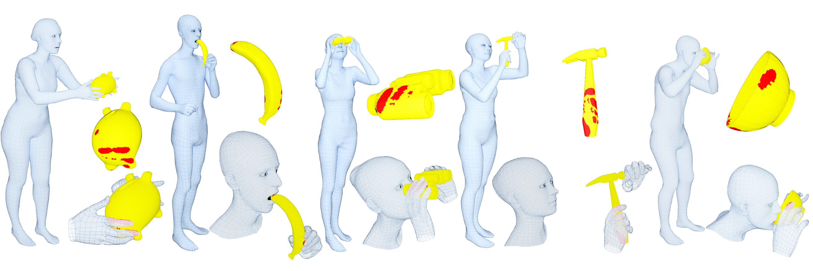
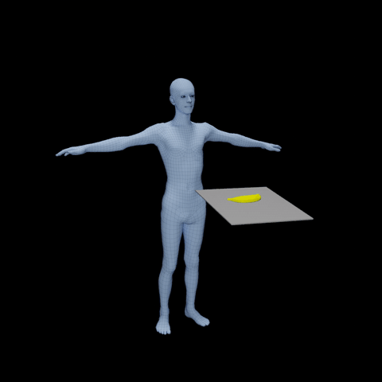
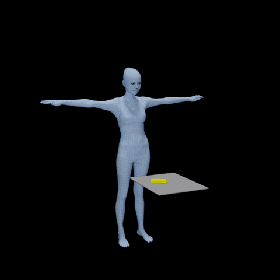
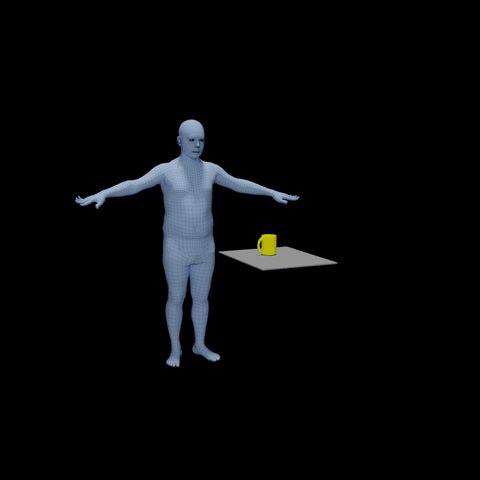
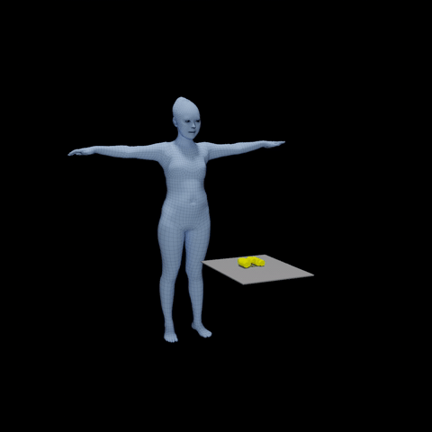

## GRAB: A Dataset of Whole-Body Human Grasping of Objects (ECCV 2020)

## Coming Soon ...

[](https://grab.is.tue.mpg.de)


[[Paper Page](https://grab.is.tue.mpg.de)] 
[[Paper](https://www.ecva.net/papers/eccv_2020/papers_ECCV/papers/123490562.pdf)] 
[[Supp. Mat.](https://www.ecva.net/papers/eccv_2020/papers_ECCV/papers/123490562-supp.pdf]

[GRAB](http://grab.is.tue.mpg.de) is a dataset of full-body motions interacting and grasping 3D objects.
It contains accurate finger and facial motions as well as the contact between the objects and body. It contains 5 male and 5 female participants and 4
different motion intents.


| Eat - Banana | Talk - Phone|Drink- Mug | See - Binoculars|
| :---: | :---: |:---: | :---: |
| ||||


Check out the YouTube video below for more details.

| Long Video | Short Video |
| :---: | :---: |
|  [](https://youtu.be/s5syYMxmNHA) | [](https://youtu.be/s5syYMxmNHA) |


## Table of Contents
  * [Description](#description)
  * [Getting Started](#getting-started)
  * [Installation](#installation)
  * [Examples](#examples)
  * [Citation](#citation)
  * [License](#license)
  * [Acknowledgments](#acknowledgments)
  * [Contact](#contact)


## Description

This repository Contains:
- Code to preprocess and prepare the GRAB data
- Tools to extract 3D vertices and meshes of the body, hands, and object
- Visualizing and rendering GRAB sequences

## Getting started
Inorder to use GRAB dataset please follow the below steps:

- Download the grab dataset from [this website](http://grab.is.tue.mpg.de) and put it in the following structure:
```bash
    GRAB
    ├── grab
    │   │
    │   ├── s1
    │   └── s2
    │   └── ...
    │   └── s9
    │   └── s10
    │  
    └── tools
    │    │
    │    ├── object_meshes
    │    └── object_settings
    │    └── subject_meshes
    │    └── subject_settings
    │    └── smplx_correspondence
    │  
    └── mocap (optional)
```
- Follow the instructions on the [SMPL-X](https://smpl-x.is.tue.mpg.de) website to download SMPL-X and MANO models.
- Install this repo to process, visualize, and render the data.

## Installation

To install the model please follow the next steps:

1. Clone this repository and install the requirements: 

```Shell
git clone https://github.com/otaheri/GRAB
```
2. Install the dependencies by the following command:
```
pip install -r requirements.txt

```

## Examples

- #### Processing the data

    After installing the *GRAB* package and downloading the data and the models from smplx website, you should be able to run the *grab_preprocessing.py*
    
    ```Shell
    python grab/grab_preprocessing.py --grab-path $GRAB_DATASET_PATH \
                                      --model-folder $SMPLX_MODEL_FOLDER \
                                      --out_path $PATH_TO_SAVE_DATA
    ```

- #### Get 3D vertices (or meshes) for GRAB
    
    In order to extract and save the vertices of the body, hands, and objects in the dataset, you can run the *get_grab_vertices.py*
    
    ```Shell
    python grab/save_grab_vertices.py --grab-path $GRAB_DATASET_PATH \
                                     --model-folder $SMPLX_MODEL_FOLDER
    ```


- #### Visualizing and rendering 3D interactive meshes
    
    To visualize and interact with GRAB 3D meshes, run the *examples/visualize_grab.py*
    
    ```Shell
    python examples/visualize_grab.py --grab-path $GRAB_DATASET_PATH \
                                      --model-folder $SMPLX_MODEL_FOLDER
    ```
    
    To render the meshes and save images in a folder please run the  *examples/render_grab.py*
    
    ```Shell
    python examples/render_grab.py --grab-path $GRAB_DATASET_PATH \
                                    --model-folder $SMPLX_MODEL_FOLDER \
                                    --render_path $PATH_TO_SAVE_RENDERINGS
    ```


## Citation

```
@inproceedings{GRAB:2020,
  title = {{GRAB}: A Dataset of Whole-Body Human Grasping of Objects},
  author = {Taheri, Omid and Ghorbani, Nima and Black, Michael J. and Tzionas, Dimitrios},
  booktitle = {European Conference on Computer Vision (ECCV)},
  year = {2020},
  url = {https://grab.is.tue.mpg.de}
}
```

## License
Software Copyright License for **non-commercial scientific research purposes**.
Please read carefully the following [terms and conditions](https://github.com/otaheri/GRAB/blob/master/LICENSE) and any accompanying documentation
before you download and/or use the GRAB data, model and software, (the "Data & Software"),
including 3D meshes (body and objects), images, videos, textures, software, scripts, and animations.
By downloading and/or using the Data & Software (including downloading,
cloning, installing, and any other use of the corresponding github repository),
you acknowledge that you have read these terms and conditions, understand them,
and agree to be bound by them. If you do not agree with these terms and conditions,
you must not download and/or use the Data & Software. Any infringement of the terms of
this agreement will automatically terminate your rights under this [License](./LICENSE).


## Acknowledgments

Special thanks to [Mason Landry](https://ps.is.tuebingen.mpg.de/person/mlandry) for his invaluable help with this project.

We thank S. Polikovsky, M. Hoschle (MH) and M. Landry (ML)
for the MoCap facility. We thank F. Mattioni, D. Hieber, and A. Valis for MoCap
cleaning. We thank ML and T. Alexiadis for trial coordination, MH and F. Grimminger
for 3D printing, V. Callaghan for voice recordings and J. Tesch for renderings. We thank Sai Kumar Dwivedi and Nikos Athanasiou for proofreading.
## Contact
The code of this repository was implemented by [Omid Taheri](https://ps.is.tue.mpg.de/person/otaheri).

For questions, please contact [grab@tue.mpg.de](mailto:grab@tue.mpg.de).

For commercial licensing (and all related questions for business applications), please contact [ps-licensing@tue.mpg.de](mailto:ps-licensing@tue.mpg.de).

